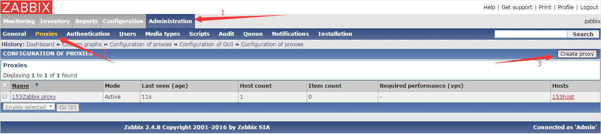
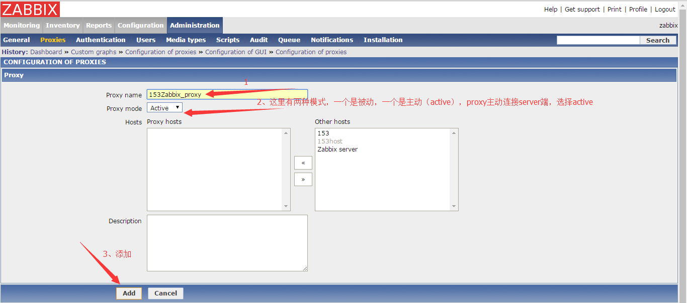

# Zabbix-proxy安装部署

**环境**：

因为公司需要监控远程客户机，但server端无法主动连接agent端，客户端可以连接公司ip，公司有固定ip，可以开放某个端口给zabbixserver，客户机agent端可以主动通过外网连接公司服务器，但没有固定ip，查过zabbix，可以有多种方法设定agent端主动连接server端，方式如下

* agent（active） 采集模式（create item）
* trapper 采集模式（create item），需要安装zabbix-sender，使用脚本启动命令，执行sender
* 还有安装proxy，这是我后来实验成功，也是最理想的

讲道理，agent（active）模式应该是最简单，最合适的，配置好对应的agent端，打开active模式，克隆模板，修改item-->type,选择active模式,具体的等实验成功再说，实践证明，是口以的，传送门：http://www.cnblogs.com/irockcode/p/6756298.html


## zabbi-proxy的搭建

* proxy跟server其实是一个性质的，只是他作用范围小，对应的功能会少点，具体体现在不能脱离server端独立运行，
* 详情传送门：https://www.zabbix.com/documentation/2.4/manual/appendix/config/zabbix_proxy
* 中文翻译版：http://www.ttlsa.com/zabbix/zabbix-proxy-proxies/
* 能yum，就不源码（proxy跟server不在同一主机上）

```
yum install -y zabbix-proxy zabbix-proxy-mysql zabbix-agent
```

* agent的配置文件中将server端ip指定为proxy的ip，及本机ip,其他配置不需要改变（web端配置时，添加hosts时，最末尾选择代理，前提是代理已经创建配置好）


## mysql库的配置

> zabbix也是一个小型的server，也需要存储数据，所以需要创建数据库，不能跟server公用一个数据库（一般server不与proxy在同一主机，但这个需要注意）

```
mysql> create database zabbix_proxy character set utf8;                           # 创建数据库
mysql> grant all on zabbix_proxy.* to zabbix@localhost identified by 'zabbix';    # 创建授权用户
mysql> flush privileges;                                                          # 刷新授权表，虽然不需要
mysql> use proxydb;
```

* `rpm -ql zabbix-proxy-mysql`   #查看安装时，创建了哪些文件


* zabbix-proxy的数据库只需要导入一条sql语句

```
mysql -uzabbix -pzabbix zabbix_proxy < /usr/share/doc/zabbix-proxy-mysql-2.4.8/create/schema.sql
```

## zabbix-proxy配置文件

* 修改配置文件/etc/zabbix/zabbix_proxy.conf

```
Server=192.168.1.154              #真正的服务端
ServerPort=18103                  #根据个人需要修改，一般可以不改，默认端口是10051，要实现转发的话使用这个选项
Hostname=153Zabbix proxy          #proxy的hostname，在web端网页配置时需要用到
DBHost=localhost                  #数据库，使用本地，也可以使用ip，我喜欢使用localhost，因为我授权就是本地，也因为配置ip失败踩过坑
DBName=zabbix_proxy               #数据库名称，创建zabbix-proxy的mysql的数据库名称
DBUser=zabbix                     #用户
DBPassword=zabbix                 #密码
#DBPort=3306                      #当DBHost填写localhost时，默认是使用socket通信的，这里配置一下也无碍
#HeartbeatFrequency=60            #心跳线（具体作用网了，看配置文件吧，这个默认就是60）
ConfigFrequency=600               #这个好像是同步配置文件的时间
DataSenderFrequency=1             #这个是proxy端向server端发送数据的时间，单位是秒，几乎等于实时同步
```

## web端创建proxy

* 添加主机信息





* 最后这里可以直接添加主机，也可以然后再添加主机，先创建hosts，在创建hosts的最下面步骤选择proxy

```
zabbix_get -s IP地址 -k agent.ping（前提需要安装get，yum install -y zabbix-get）
```
