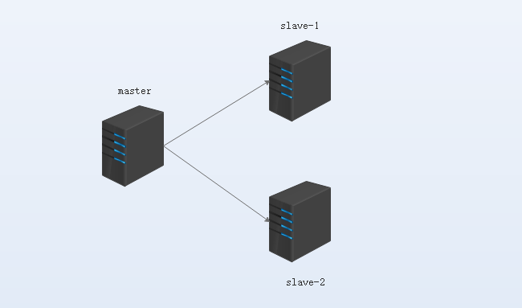
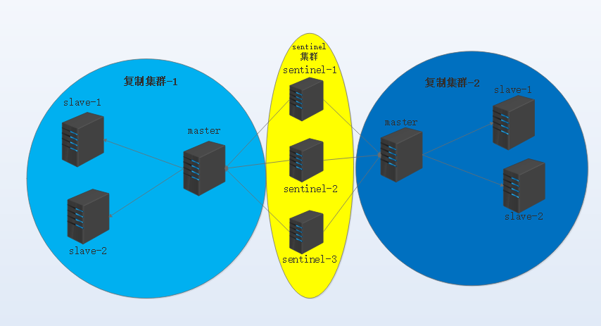

# Redis主从复制与高可用方案

## redis简单介绍

Redis 是完全开源免费的，遵守`BSD`协议，是一个高性能的`key-value`数据库。`Redis`与其他`key – value`缓存产品有以下三个特点：

* 支持数据的持久化，可以将内存中的数据保存在磁盘中，重启的时候可以再次加载进行使用。
* 不仅仅支持简单的`key-value`类型的数据，同时还提供`list`，`set`，`zset`，`hash`等数据结构的存储。
* 支持数据的备份，即`master-slave`模式的数据备份。
## Redis的持久化

### RDB：snapshotting

二进制格式；按事先定制的策略，周期性地将数据从内存同步至磁盘；数据文件默认为dump.rdb；
客户端显式使用SAVE或BGSAVE命令来手动启动快照保存机制；

* SAVE：同步,即在主线程中保存快照，此时会阻塞所有客户端请求；
* BGSAVE：异步,backgroud：后台启动快照线程，服务不受影响

**RDB相关的配置**

```
save <seconds> <changes>  触发快照的策略

save 900 1   #第一级匹配
save 300 10   ： 达不到第三个就匹配第二级
save 60 10000  ： 60秒内有10000个键发生更改就触发快照

#表示：三个策略满足其中任意一个均会触发SNAPSHOTTING操作；
900s内至少有一个key有变化，300s内至少有10个key有变化，
60s内至少有1W个key发生变化；
```

**其他参数**

* stop-writes-on-bgsave-error yes : dump操作出现错误时，是否禁止新的写入操作请求；
* rdbcompression yes :压缩存放，节约I/O
* rdbchecksum yes ；校验
* dbfilename dump.rdb：指定rdb文件名
* dir /var/lib/redis：rdb文件的存储路径

#### AOF：Append Only File, fsync

记录每次写操作至指定的文件尾部实现的持久化，当redis重启时，可通过重新执行文件中的命令在内存中重建出数据库，

**BGREWRITEAOF：AOF文件重写**

不会读取正在使用AOF文件，而是通过将内存中的数据以命令的方式保存至临时文件中，完成之后替换原来的AOF文件；

**AOF相关的配置**

* appendonly no ：默认禁用
* appendfilename “appendonly.aof” ：
* appendfsync ：将aof文件的缓冲区数据同步到磁盘，防止故障导致数据丢失，同步频繁会导致I/O负载过大，可以同步方式如下：
  * no：redis：不执行主动同步操作，而是OS进行；
  * everysec：每秒一次；
  * always：每语句一次；
* no-appendfsync-on-rewrite no ：是否在后台执行aof重写期间不调用fsync，默认为no，表示调用；
* auto-aof-rewrite-percentage 100 ：对aof文件变化量的控制
* auto-aof-rewrite-min-size 64mb ：对aof规定大小最小达到64MB才重写

上述两个条件同时满足时，方会触发重写AOF；与上次aof文件大小相比，其增长量超过100%，且大小不少于64MB;

* aof-load-truncated yes ：装载aof文件时如果有残缺部分则自动修剪（清理掉）
* 注意：持久机制本身不能取代备份；应该制订备份策略，对redis库定期备份；

两种存储方式最好不要同时启用，RDB与AOF同时启用特点如下

* (1) BGSAVE和BGREWRITEAOF不会同时进行；
* (2) Redis服务器启动时用持久化的数据文件恢复数据，会优先使用AOF；


## redis主从复制


redis主从复制的特点：

* 一个Master可以有多个slave主机，支持链式复制；
* Master以非阻塞方式同步数据至slave主机；



配置redis主从复制相对比较简单：
在一台节点上配置文件中定义自己是谁的从节点，并且启用主节点密码认证即可。
下面使用3台主机配置一主两从的结构，redis使用一主多从的结构时还可以实现像mysql MHA那样的复制集群，当master节点宕机后，可以在两个slave节点中根据优先级选举新的master。因此这里使用3个节点，这部分内容会在后面单独说道。

### 复制的两种方式

新的从节点或某较长时间未能与主节点进行同步的从节点重新与主节点通信，需要做“full synchronization”，此时其同步方式有两种方式：
* Disk-backend：主节点基于内存创建快照文件于磁盘中，而后将其发送给从节点；从节点收到快照进行恢复，快照恢复完后接着快照的那一刻随后内容进行复制，主节点每写一行，并直接将语句发送给从节点（跨网络复制适合）
* Diskless：主节占新创建快照后直接通过网络套接字文件发送给从节点；为了实现并行复制，通常需要在复制启动前延迟一个时间段；（占用网络带宽）

## 安装配置redis一主多从

* 各节点安装redis

```
yum install redis -y
```

* 配置master节点

```
bind 0.0.0.0     #绑定地址
requirepass gudaoyufu   #启用密码认证
#默认master节点修改这两项就可以了，也可以进行其他设置
```

* 配置各slave节点

```
bind 0.0.0.0    
slaveof 192.168.214.148 6379   #定义master信息
masterauth gudaoyufu  #认证
```

从节点上配置这三项页就可以，其他参数可以根据情况选择调整即可。

修改后记得重启服务，此时登录到master节点查看信息：

```
[root@master ~]# redis-cli -h 127.0.0.1 -a gudaoyufu
127.0.0.1:6379> CLIENT LIST
id=5 addr=192.168.214.149:39804 fd=5 name= age=326 idle=1 flags=S db=0 sub=0 psub=0 multi=-1 qbuf=0 qbuf-free=0 obl=0 oll=0 omem=0 events=r cmd=replconf
id=7 addr=127.0.0.1:35262 fd=6 name= age=4 idle=0 flags=N db=0 sub=0 psub=0 multi=-1 qbuf=0 qbuf-free=32768 obl=0 oll=0 omem=0 events=r cmd=client

#看到第一条记录最后cmd=replconf就说明该节点是从节点
```

或者使用指令INFO replication指令查看信息：

```
127.0.0.1:6379> INFO replication
# Replication
role:master   #自己的角色
connected_slaves:1  #从节点数量
slave0:ip=192.168.214.149,port=6379,state=online,offset=995,lag=1   #从节点信息
master_repl_offset:995
repl_backlog_active:1
repl_backlog_size:1048576
repl_backlog_first_byte_offset:2
repl_backlog_histlen:994
```

接着将slave-2也配置好，与slave-1配置相同即可，配置好后重启服务，查看master节点信息

```
127.0.0.1:6379> INFO replication
# Replication
role:master
connected_slaves:2
slave0:ip=192.168.214.149,port=6379,state=online,offset=1793,lag=1
slave1:ip=192.168.214.150,port=6379,state=online,offset=1793,lag=1
master_repl_offset:1793
repl_backlog_active:1
repl_backlog_size:1048576
repl_backlog_first_byte_offset:2
repl_backlog_histlen:1792
```

可以看到信息发送变化，两个从节点已经上线，接下来可以进行简单的验证复制，在master节点设置一个key，看两个slave节点复制情况：

master节点创建一个key

```
127.0.0.1:6379> SET mykey 111
OK
127.0.0.1:6379> get mykey
"111"
```

两个slave节点查看：

```
[root@slave-1 ~]# redis-cli -h 127.0.0.1 -a gudaoyufu
127.0.0.1:6379> get mykey
"111"
#
[root@slave-2 ~]# redis-cli -h 127.0.0.1 -a gudaoyufu
127.0.0.1:6379> get mykey
"111"
```

**slave节点定义也可以通过指令设置，设置后立即生效，并且会被保存至配置文件中，指令配置方式如下：**

配置slave节点：

```
redis-cli> SLAVEOF <MASTER_IP> <MASTER_PORT>
redis-cli> CONFIG SET masterauth <PASSWORD>
```

#### redis主从复制相关配置

下面是redis主从复制场景的一些可调参数，需要根据实际环境调整

* slave-serve-stale-data yes ： 是否可以把不新鲜的数据服务与客户端
* slave-read-only yes ： 从节点只读，启用slaveof定义后才生效
* repl-diskless-sync no ：是否同时向多个从节点同时发数据
* repl-diskless-sync-delay 5 ：发送的延迟时间
* repl-ping-slave-period 10 探测从节点状态
* repl-timeout 60 探测节点超时时间
* repl-disable-tcp-nodelay no ： 启用nodelay
* repl-backlog-size 1mb
* slave-priority 100 ： 从节点优先级,复制集群中，主节点故障时，sentinel应用场景中的主节点选举时使用的优先级；数字越小优先级越高，但0表示不参与选举；
* min-slaves-to-write 3：主节点仅允许其能够通信的从节点数量大于等于此处的值时接受写操作；
* min-slaves-max-lag 10：从节点延迟时长超出此处指定的时长时，主节点会拒绝写入操作；


### redis sentinel 高可用复制集群

Redis-Sentinel是Redis官方推荐的高可用性(HA)解决方案，当用Redis做Master-slave的高可用方案时，如果master宕机，Redis自身并不能实现自动进行主备切换，sentinel可以监控复制节点的状态，当主节点宕机后，它能根据选举方式选出后端的一个从节点作为新的master，sentinel还能监控多个master-slave集群，发现master宕机后能进行自动切换。

同时，sentinel本身也存在单点问题，通常sentinel也是一个集群，因此，redis的复制集群通常是下面的结构



#### sentinel集群工作原理

sentinel集群通过给定的配置文件发现master，启动时会监控master。通过向master发送info信息获得该服务器下面的所有从服务器。

sentinel集群通过流言协议与其他sentinel通信，以此来发现监视同一个主服务器的其他sentinel；集群之间会互相创建命令连接用于通信。

sentinel集群使用ping命令来检测实例的状态，如果在指定的时间内（down-after-milliseconds）没有回复或则返回错误的回复，sentinel会认为主节点宕机，但是并不会立即提升一个从节点为新的master，因为会存在误判的情况，此时为主观宕机
此时当sentinel集群中有一半以上的节点通告master为宕机状态时，此时为客观宕机，sentinel基于选举协议选举提升从节点为新的master，从节点之间根据优先级来决策谁会成为新的master，修复的节点重新上线后作为从节点工作。

#### 配置sentinel 集群

下面使用上面的结构图，配置sentinel集群，来监控上面已经配置好的复制集群，实现高可用复制集群。
由于没有那么多机器，这里只使用6台主机做两个master-slave复制集群，把sentinel集群同时放在其中一组集群上与redis复制集群共存。sentinel集群同时监控两个复制集群。

安装redis安装时自带了sentinel功能，因此只要安装了redis即可，在创建一个复制集群，并在第二个复制集群上创建sentinel集群共存。

#### 安装redis

```
[root@redis-master ~]# yum install redis -y
[root@redis-salve-1 ~]# yum install redis -y
[root@redis-salve-2 ~]# yum install redis -y
```

配置主从复制

```
bind 0.0.0.0     
requirepass gudaoyufu.com
```

启动主节点redis：`service redis start`

启动两个从节点使用指令配置从节点为slave

```
[root@redis-salve-1 ~]# systemctl start redis
[root@redis-slave-2 ~]# systemctl start redis
```

salve节点配置：

```
[root@redis-salve-1 ~]# redis-cli
127.0.0.1:6379> slaveof 192.168.214.141 6379
OK
127.0.0.1:6379> config set masterauth gudaoyufu.com
OK

#

[root@redis-slave-2 ~]# redis-cli
127.0.0.1:6379> slaveof 192.168.214.141 6379
OK
127.0.0.1:6379> config set masterauth gudaoyufu.com
OK
```

主节点查看

```
[root@redis-master ~]# redis-cli -h 127.0.0.1 -a gudaoyufu.com
127.0.0.1:6379> info replication
# Replication
role:master
connected_slaves:2
slave0:ip=192.168.214.143,port=6379,state=online,offset=827,lag=1
slave1:ip=192.168.214.147,port=6379,state=online,offset=827,lag=1
master_repl_offset:841
repl_backlog_active:1
repl_backlog_size:1048576
repl_backlog_first_byte_offset:2
repl_backlog_histlen:840
```

**调整两个复制集群slave的优先级**
两个集群中选一个slave节点调低优先级

```
slave-priority 90
#重启
systemctl restart redis
```


配置sentinel监控集群

```
[root@redis-master ~]# vim /etc/redis-sentinel.conf

bind 0.0.0.0
port 26379

sentinel monitor mymaster-1 192.168.214.141 6379 2
sentinel monitor mymaster-2 192.168.214.148 6379 2

sentinel auth-pass  mymaster-1 gudaoyufu.com
sentinel auth-pass  mymaster-2 gudaoyufu

sentinel down-after-milliseconds mymaster-1 30000
sentinel down-after-milliseconds mymaster-2 30000

sentinel parallel-syncs mymaster-1 1
sentinel parallel-syncs mymaster-2 1

sentinel failover-timeout mymaster-1 180000
sentinel failover-timeout mymaster-2 180000

logfile /var/log/redis/sentinel.log
```

**将上面的配置文件配置好后各自复制一份到其他两个节点，注意：复制配置文件一定要在启动redis-sentinel服务之前，因为启动服务后配置文件中会生成id号，服务个节点的id相同会造成无法选举新的master节点**

配置文件复制后启动各节点redis-sentinel服务。

```
service  redis-sentinel start
systemctl  start redis-sentinel
（我使用的系统版本不一样，所以指令不同）
```
在redis-sentinel.conf文件中分别定义两个复制集群的master信息。

**参数作用**

* sentinel monitor < master-name > < ip > < redis-port > < quorum >
* sentinel auth-pass < master-name > < password >
 * < quorum >表示sentinel集群的quorum机制，即至少有quorum个sentinel节点同时判定主节点故障时，才认为其真的故障；
* sentinel down-after-milliseconds < master-name > < milliseconds > ：监控到指定的集群的主节点异常状态持续多久方才将标记为“故障”；
* sentinel parallel-syncs < master-name > < numslaves > ： 指在failover过程中，能够被sentinel并行配置的从节点的数量；
* sentinel failover-timeout < master-name > < milliseconds > ：sentinel必须在此指定的时长内完成故障转移操作，否则，将视为故障转移操作失败；
* sentinel notification-script < master-name > < script-path > ：通知脚本，此脚本被自动传递多个参数；

#### 测试故障转移

停掉mymaster-2的主节点 （192.168.214.148 ），查看mymaster-2的主节点有没有发生改变：

```
[root@redis-master ~]# redis-cli -p 26379
127.0.0.1:26379> SENTINEL masters
1)  1) "name"
    2) "mymaster-1"
    3) "ip"
    4) "192.168.214.141"
    5) "port"
    6) "6379"
    7) "runid"
    8) "c068ea99d1f60e1eb5822d6eecbde47a45661509"
    9) "flags"
   10) "master"
   11) "link-pending-commands"
   12) "0"
   13) "link-refcount"
   14) "1"
   15) "last-ping-sent"
   16) "0"
   17) "last-ok-ping-reply"
   18) "151"
   19) "last-ping-reply"
   20) "151"
   21) "down-after-milliseconds"
   22) "30000"
   23) "info-refresh"
   24) "770"
   25) "role-reported"
   26) "master"
   27) "role-reported-time"
   28) "793908"
   29) "config-epoch"
   30) "0"
   31) "num-slaves"
   32) "2"
   33) "num-other-sentinels"
   34) "2"
   35) "quorum"
   36) "2"
   37) "failover-timeout"
   38) "180000"
   39) "parallel-syncs"
   40) "1"
2)  1) "name"
    2) "mymaster-2"
    3) "ip"
    4) "192.168.214.149"
    5) "port"
    6) "6379"
    7) "runid"
    8) "60ba5b8b5cc52fbb691179ec43b8582a161ed7e8"
    9) "flags"
   10) "master"
   11) "link-pending-commands"
   12) "0"
   13) "link-refcount"
   14) "1"
   15) "last-ping-sent"
   16) "0"
   17) "last-ok-ping-reply"
   18) "7"
   19) "last-ping-reply"
   20) "7"
   21) "down-after-milliseconds"
   22) "30000"
   23) "info-refresh"
   24) "5101"
   25) "role-reported"
   26) "master"
   27) "role-reported-time"
   28) "35884"
   29) "config-epoch"
   30) "1"
   31) "num-slaves"
   32) "2"
   33) "num-other-sentinels"
   34) "2"
   35) "quorum"
   36) "2"
   37) "failover-timeout"
   38) "180000"
   39) "parallel-syncs"
   40) "1"
```

从上的一堆信息中可以看到已经改变了

```
2) "mymaster-2"
3) "ip"
4) "192.168.214.149"   #新的master
#注意：slave节点的值越小，优先级越高
```

至此，两个redis的高可用复制集群已经完成了，还有一些参数根据环境调整即可

**SENTINEL常用指令**

```
redis-cli -h SENTINEL_HOST -p SENTINEL_PORT
redis-cli>
SENTINEL masters
SENTINEL slaves < MASTER_NAME >
SENTINEL failover < MASTER_NAME >
SENTINEL get-master-addr-by-name < MASTER_NAME >
```
